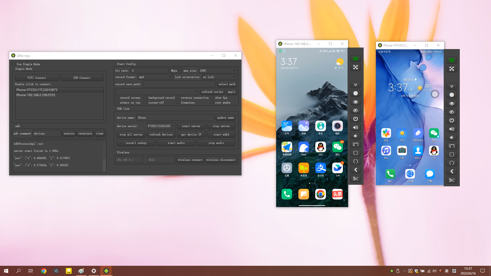
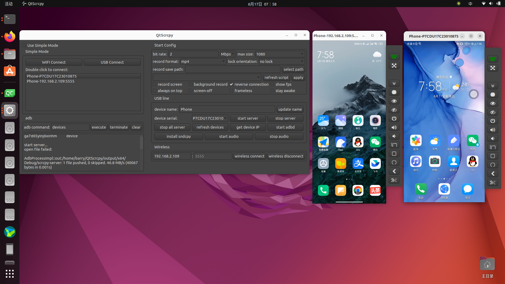

# QtScrcpy 

[中文用户？点我查看中文介绍](README_zh.md)

QtScrcpy supports displaying and controlling Android devices via USB or over network. It does NOT require root privileges.

It supports three major platforms: GNU/Linux, Windows and macOS.

It focuses on:

 - **lightness** (displays only the device screen)
 - **performance** (30~60 fps)
 - **quality** (1920×1080 or above)
 - **low latency** ([35~70ms][lowlatency])
 - **low startup time** (only about 1 second to display the first frame)
 - **non-intrusiveness** (nothing will be installed on the device)

[lowlatency]: https://github.com/Genymobile/scrcpy/pull/646

## The author has developed a more professional screen casting software called `QuickMirror`
QuickMirror function&features:
- Equipment screen casting&control: batch screen casting, individual control, batch control
- Group management
- WiFi screen mirroring/OTG screen mirroring
- Adb shell shortcut command
- File transfer, apk installation
- Multiple screen mirroring: In OTG mirroring mode, with low resolution and smoothness settings, a single computer can manage 500+phones simultaneously
- Low latency: USB screen mirroring 1080p latency is within 30ms, which is lower than all screen mirroring software on the market in terms of latency at the same resolution and smoothness
- Low CPU usage: pure C++development, high-performance GPU video rendering
- High resolution: adjustable, maximum support for native resolution of Android terminals
- Perfect Chinese input: Supports Xianyu app, supports Samsung phones
- The free version can cast up to 10 screens, with unlimited functionality (except for automatic screen mirroring)
- QuickMirror tutorial: https://lrbnfell4p.feishu.cn/docx/EMkvdfIvDowy3UxsXUCcpPV8nDh
- QuickMirror Telegram communication group: https://t.me/+EnQNmb47C_liYmRl
- Preview of QuickMirror Interface:

## Mapping Keys
You can write your script to map keyboard and mouse actions to touches and clicks of the mobile phone according to your needs. [Here](docs/KeyMapDes.md) are the script writing rules.

Script for TikTok and some other games are provided by default. Once enabled, you can play the game with your keyboard and mouse. The default key mapping for PUBG Mobile is as follows:

Instruction for adding new customized mapping files.

- Write a customized script and put it in the `keymap` directory
- Click `refresh script` to show it
- Select your script
- Connect to your phone, start service and click `apply`
- Press `~` key (the SwitchKey in the key map script) to switch to custom mapping mode
- Press the ~ key again to switch back to normal mode
- (For games such as PUBG Mobile) If you want to move vehicles with the STEER_WHEEL keys, you need to set the move mode to `single rocker mode`.

If you don't know how to manually write mapping rules, you can also use the `QuickAssistant` developed by the author
QuickAssistant Features&Functions:
- Play Android mobile games smoothly through keyboard and mouse
- Interface based editing of key mapping script
- Support pausing the computer screen and using only keyboard and mouse operations
- Screenshot&Recording of Mobile Screen
- Simple batch control
- Android 11+supports playing mobile audio on computers (under development...)
- Mobile app installation free
- Fast and instant connection
- Low latency: USB screen mirroring 1080p latency is within 30ms, which is lower than all screen mirroring software on the market in terms of latency at the same resolution and smoothness
- Low CPU usage: pure C++development, high-performance GPU video rendering
- High resolution: adjustable, maximum support for native resolution of Android terminals
- Telegram Group：https://t.me/+Ylf_5V_rDCMyODQ1
- [QuickAssistant](https://lrbnfell4p.feishu.cn/drive/folder/Hqckfxj5el1Wjpd9uezcX71lnBh)

## Group control
You can control all your phones at the same time.

## Star History

## Thanks

QtScrcpy is based on [Genymobile](https://github.com/Genymobile)'s [scrcpy](https://github.com/Genymobile/scrcpy) project. Thanks a lot!

The difference between QtScrcpy and the original scrcpy is as follows:

key points|scrcpy|QtScrcpy
--|:--:|:--:
ui|sdl|qt
video encode|ffmpeg|ffmpeg
video render|sdl|opengl
cross-platform|self implemented|provided by Qt
language|C|C++
style|sync|async
keymap|no custom keymap|support custom keymap
build|meson+gradle|qmake or CMake

- It's very easy to customize your GUI with Qt
- Asynchronous programming of Qt-based signal slot mechanism improves performance
- Easy to learn
- Add support for multi-touch

## Learn

If you are interested in it and want to learn how it works but do not know how to get started, you can choose to purchase my recorded video lessons.
It details the development architecture and the development process of the entire software and helps you develop QtScrcpy from scratch.

Course introduction：[https://blog.csdn.net/rankun1/article/details/87970523](https://blog.csdn.net/rankun1/article/details/87970523)

You can join Telegram Group for QtScrcpy and exchange ideas with like-minded friends.：

Telegram Group：https://t.me/+EnQNmb47C_liYmRl

## Requirements
Android API >= 21 (Android 5.0).

Make sure you have enabled [ADB debugging][enable-adb] on your device(s).

[enable-adb]: https://developer.android.com/studio/command-line/adb.html#Enabling

## Download

[gitee-download]: https://gitee.com/Barryda/QtScrcpy/releases
[github-download]: https://github.com/barry-ran/QtScrcpy/releases

### Windows
On Windows, for simplicity, prebuilt archives with all the dependencies (including ADB) are available at Releases:

 - [`QtScrcpy`][github-download]

or you can [build it yourself](#Build)

### Mac OS
On Mac OS, for simplicity, prebuilt archives with all the dependencies (including ADB) are available at Releases:

- [`QtScrcpy`][github-download]

or you can [build it yourself](#Build)

### Linux
For Arch Linux Users, you can use AUR to install: `yay -Syu qtscrcpy` (may be outdated; maintainer: [yochananmarqos](https://aur.archlinux.org/account/yochananmarqos))

For users in other distros, you can use the prebuilt archives from Releases:

- [`QtScrcpy`][github-download]

or you can get it at [GitHub Actions](https://github.com/barry-ran/QtScrcpy/actions/workflows/ubuntu.yml), in branch `dev` and download the latest artifact.

or you can [build it yourself](#Build) (not recommended, get it in Actions if you can)

## Run
Connect to your Android device on your computer, then run the program and click `USB connect` or `WiFi connect`

### Wireless connection steps (ensure that the mobile phone and PC are on the same LAN):
1. Enable USB debugging in developer options on the Android device
2. Connect the Android device to the computer via USB
3. Click update device, and you will see that the device number is updated
4. Click get device IP
5. Click start adbd
6. Click wireless connect
7. Click update device again, and another device with an IP address will be found. Select this device.
8. Click start service

Note: it is not necessary to keep your Android device connected via USB after you start adbd.

## Interface button introduction：

- Start config: function parameter settings before starting the service    

    You can set the bit rate, resolution, recording format, and video save path of the locally recorded video.

    - Background record: the Android device screen is not displayed after starting the service. It is recorded in the background.
    - Always on top: the video window for Android devices will be kept on the top
    - Close screen: automatically turn off the Android device screen to save power after starting the service
    - Reverse connection: service startup mode. You can uncheck it if you experience connection failure with a message `more than one device`
    
- Refresh devices: Refresh the currently connected device
- Start service: connect to the Android device
- Stop service: disconnect from the Android device
- Stop all services: disconnect all connected Android devices
- Get device IP: Get the IP address of the Android device and update it to the "Wireless" area for the ease of wireless connection setting.
- Start adbd: Start the adbd service of the Android device. You must start it before the wireless connection.
- Wireless connect: Connect to Android devices wirelessly
- Wireless disconnect: Disconnect wirelessly connected Android devices
- adb command: execute customized ADB commands (blocking commands are not supported now, such as a shell)

## The main function
- Display Android device screens in real-time
- Real-time mouse and keyboard control of Android devices
- Screen recording
- Screenshot to png
- Wireless connection
- Supports multiple device connections
- Full-screen display
- Display on the top
- Install apk: drag and drop apk to the video window to install
- Transfer files: Drag files to the video window to send files to Android devices
- Background recording: record only, no display interface
- Copy-paste

    It is possible to synchronize clipboards between the computer and the device, in
    both directions:

    - `Ctrl + c` copies the device clipboard to the computer clipboard;
    - `Ctrl + Shift + v` copies the computer clipboard to the device clipboard;
    - `Ctrl + v` _pastes_ the computer clipboard as a sequence of text events (non-ASCII characters does not yet work).
- Group control
- Sync device speaker sound to the computer (based on [sndcpy](https://github.com/rom1v/sndcpy), Android 10+ only)

## Shortcuts

 | Action                                 |   Shortcut (Windows)          |   Shortcut (macOS)
 | -------------------------------------- |:----------------------------- |:-----------------------------
 | Switch fullscreen mode                 | `Ctrl`+`f`                    | `Cmd`+`f`
 | Resize window to 1:1 (pixel-perfect)   | `Ctrl`+`g`                    | `Cmd`+`g`
 | Resize window to remove black borders  | `Ctrl`+`w` \| _Double-click¹_ | `Cmd`+`w`  \| _Double-click¹_
 | Click on `HOME`                        | `Ctrl`+`h` \| _Middle-click_  | `Ctrl`+`h` \| _Middle-click_
 | Click on `BACK`                        | `Ctrl`+`b` \| _Right-click²_  | `Cmd`+`b`  \| _Right-click²_
 | Click on `APP_SWITCH`                  | `Ctrl`+`s`                    | `Cmd`+`s`
 | Click on `MENU`                        | `Ctrl`+`m`                    | `Ctrl`+`m`
 | Click on `VOLUME_UP`                   | `Ctrl`+`↑` _(up)_             | `Cmd`+`↑` _(up)_
 | Click on `VOLUME_DOWN`                 | `Ctrl`+`↓` _(down)_           | `Cmd`+`↓` _(down)_
 | Click on `POWER`                       | `Ctrl`+`p`                    | `Cmd`+`p`
 | Power on                               | _Right-click²_                | _Right-click²_
 | Turn device screen off (keep mirroring)| `Ctrl`+`o`                    | `Cmd`+`o`
 | Expand notification panel              | `Ctrl`+`n`                    | `Cmd`+`n`
 | Collapse notification panel            | `Ctrl`+`Shift`+`n`            | `Cmd`+`Shift`+`n`
 | Copy to clipboard³                     | `Ctrl`+`c`                    | `Cmd`+`c`
 | Cut to clipboard³                      | `Ctrl`+`x`                    | `Cmd`+`x`
 | Synchronize clipboards and paste³      | `Ctrl`+`v`                    | `Cmd`+`v`
 | Inject computer clipboard text         | `Ctrl`+`Shift`+`v`            | `Cmd`+`Shift`+`v`

_¹Double-click on black borders to remove them._  

_²Right-click turns the screen on if it was off, presses BACK otherwise._

_³Only on Android >= 7._

## TODO
[TODO](docs/TODO.md)

## FAQ
[FAQ](docs/FAQ.md)

## DEVELOP
[DEVELOP](docs/DEVELOP.md)

Everyone is welcome to maintain this project and contribute your own code, but please follow these requirements:
1. Please open PRs to the dev branch instead of the master branch
2. Please rebase the original project before opening PRs
3. Please submit PRs on the principle of "small amounts, many times" (one PR for a change is recommended)
4. Please keep the code style consistent with the existing style.

## Why develop QtScrcpy?
There are several reasons listed below according to importance (high to low).
1. In the process of learning Qt, I need a real project to try.
2. I have some background skills in audio and video and I am interested in them.
3. I have some Android development skills. But I have used it for a long time. I want to consolidate it.
4. I found scrcpy and decided to re-make it with the new technology stack (C++ + Qt + Opengl + FFmpeg).

## Build
All the dependencies are provided and it is easy to compile.

### QtScrcpy
#### Non-Arch Linux Users
1. Set up the Qt development environment with the official Qt installer or third-party tools such as [aqt](https://github.com/miurahr/aqtinstall) on the target platform.
   Qt version bigger than 5.12 is required. (use MSVC 2019 on Windows)
2. Clone the project with `git clone --recurse-submodules git@github.com:barry-ran/QtScrcpy.git`
3. For Windows, open CMakeLists.txt with QtCreator and compile Release
4. For Linux, directly run `./ci/linux/build_for_linux.sh "Release"`
Note: compiled artifacts are located at `output/x64/Release`

#### Arch Linux Users
1. Install packages: `base-devel cmake qt5-base qt5-multimedia qt5-x11extras` (`qtcreator` is recommended)
2. Clone the project with `git clone --recurse-submodules git@github.com:barry-ran/QtScrcpy.git`
3. Run `./ci/linux/build_for_linux.sh "Release"`

### Scrcpy-Server
1. Set up Android development environment on the target platform
2. Open server project in project root with Android Studio
3. The first time you open it, if you do not have the corresponding version of Gradle, you will be prompted to find Gradle, whether to upgrade Gradle or create it. Select Cancel. After cancelling, you will be prompted to select the location of existing Gradle. Cancel it too and it will download automatically.
4. After compiling the apk, rename it to scrcpy-server and replace QtScrcpy/QtScrcpyCore/src/third_party/scrcpy-server.

## Licence
Since it is based on scrcpy, it uses the same license as scrcpy

    Copyright (C) 2025 Rankun
    
    Licensed under the Apache License, Version 2.0 (the "License");
    you may not use this file except in compliance with the License.
    You may obtain a copy of the License at
    
        http://www.apache.org/licenses/LICENSE-2.0
    
    Unless required by applicable law or agreed to in writing, software
    distributed under the License is distributed on an "AS IS" BASIS,
    WITHOUT WARRANTIES OR CONDITIONS OF ANY KIND, either express or implied.
    See the License for the specific language governing permissions and
    limitations under the License.

## About the author

[Barry CSDN](https://blog.csdn.net/rankun1)

An ordinary programmer, working mainly in C++ for desktop client development, graduated from Shandong for more than a year of steel simulation education software, and later moved to Shanghai to work in security, online education-related fields, familiar with audio and video. I have an understanding of audio and video fields such as voice calls, live education, video conferencing and other related solutions. I also have experience in Android, Linux servers and other kinds of development.

## Contributors

### Code Contributors

This project exists thanks to all the people who contribute. [[Contribute](CONTRIBUTING.md)].

### Financial Contributors

Become a financial contributor and help us sustain our community. [[Contribute](https://opencollective.com/QtScrcpy/contribute)]

#### Individuals

#### Organizations

Support this project with your organization. Your logo will show up here with a link to your website. [[Contribute](https://opencollective.com/QtScrcpy/contribute)]

