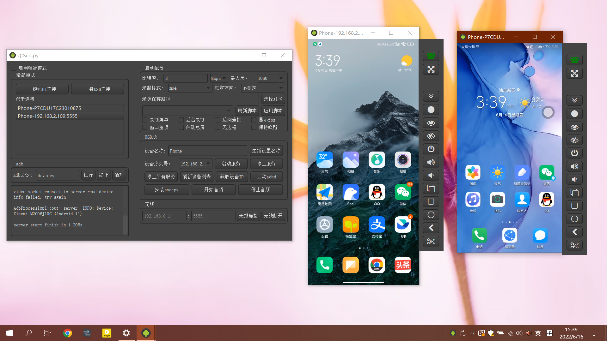
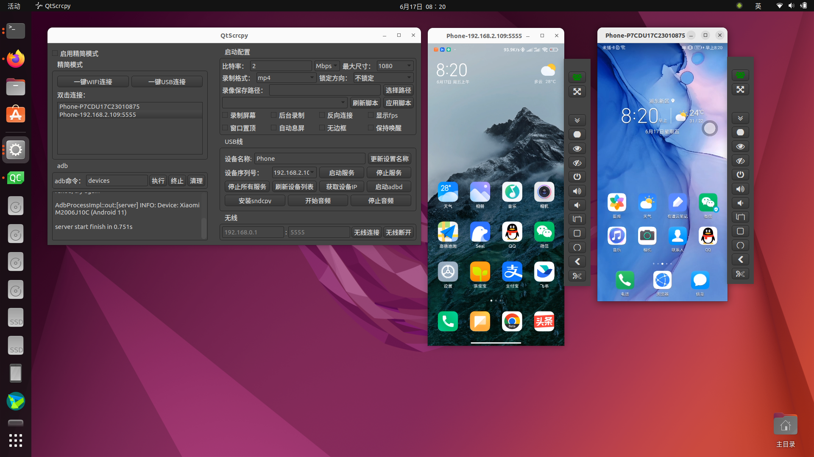
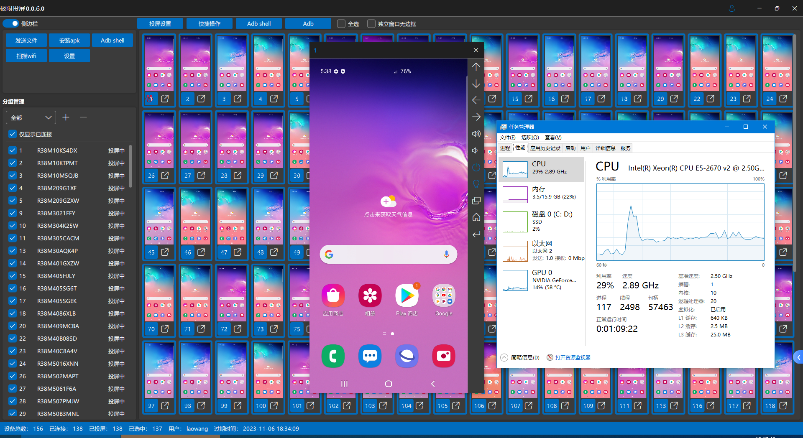
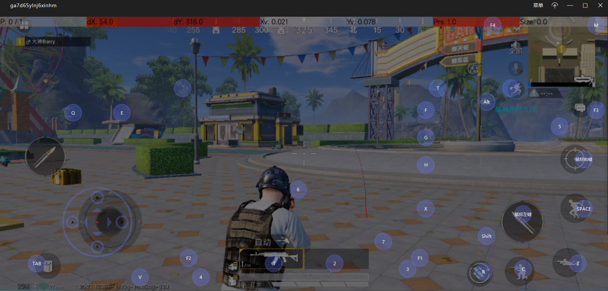

# QtScrcpy

[Speaks English? Click me for English introduction.](README.md)

QtScrcpy 可以通过 USB / 网络连接Android设备，并进行显示和控制。无需root权限。

同时支持 GNU/Linux ，Windows 和 MacOS 三大主流桌面平台。

它专注于:

 - **精致** (仅显示设备屏幕)
 - **性能** (30~60fps)
 - **质量** (1920×1080以上)
 - **低延迟** ([35~70ms][低延迟])
 - **快速启动** (1s 内就可以看到第一帧图像)
 - **非侵入性** (不在设备上安装任何软件)

[低延迟]: https://github.com/Genymobile/scrcpy/pull/646

## 作者开发了更加专业的投屏软件`极限投屏`
极限投屏功能&特点：
- 设备投屏&控制：批量投屏、单个控制、批量控制
- 分组管理
- wifi投屏/OTG投屏
- adb shell快捷指令
- 文件传输、apk安装
- 投屏数量多：在OTG投屏模式，设置分辨率和流畅度为低的情况下，单台电脑可以同时管理500+台手机
- 低延迟：usb投屏1080p延迟在30ms以内，在相同分辨率流畅度情况下，比市面上所有投屏软件延迟都低
- cpu占用率低：纯C++开发，高性能GPU视频渲染
- 高分辨率：可调节，最大支持安卓终端的原生分辨率
- 完美中文输入：支持闲鱼app，支持三星手机
- 免费版最多投屏10台，功能无限制(除了自动重新投屏)
- 极限投屏使用教程：https://lrbnfell4p.feishu.cn/docx/QRMhd9nImorAGgxVLlmczxSdnYf
- 极限投屏qq交流群：822464342
- 极限投屏界面预览：

## 自定义按键映射
可以根据需要，自己编写脚本将键盘按键映射为手机的触摸点击，编写规则在[这里](docs/KeyMapDes_zh.md)。

默认自带了针对和平精英手游和抖音进行键鼠映射的映射脚本，开启平精英手游后可以用键鼠像玩端游一样玩和平精英手游，开启抖音映射以后可以使用上下左右方向键模拟上下左右滑动，你也可以按照[编写规则](docs/KeyMapDes_zh.md)编写其他游戏的映射文件，默认按键映射如下：

自定义按键映射操作方法如下：
- 编写自定义脚本放入 keymap 目录
- 点击刷新脚本，确保脚本可以被检测到
- 选择需要的脚本
- 连接手机并启动服务之后，点击应用脚本
- 按`~`（即脚本中定义的 SwitchKey）键切换为自定义映射模式即可启用
- 再次按~键切换为正常控制模式
- （对于和平精英等游戏）若想使用方向盘控制载具，记得在载具设置中设置为单摇杆模式

如果不会自己手写映射规则，也可以去使用作者开发的`极限手游助手`
极限手游助手功能&特点：
- 通过键盘鼠标畅玩安卓手机游戏
- 按键映射脚本界面化编辑
- 支持暂停电脑端画面，只使用键鼠操作
- 截图&录制手机画面
- 简单批量控制
- 安卓11+支持电脑播放手机音频（开发中...）
- 手机端免安装App
- 极速秒连接
- 低延迟：usb投屏1080p延迟在30ms以内，在相同分辨率流畅度情况下，比市面上所有投屏软件延迟都低
- cpu占用率低：纯C++开发，高性能GPU视频渲染
- 高分辨率：可调节，最大支持安卓终端的原生分辨率
- [QQ交流群：901736468](https://qm.qq.com/q/wRJJaWLWc8)
- [极限手游助手说明文档](https://lrbnfell4p.feishu.cn/drive/folder/Hqckfxj5el1Wjpd9uezcX71lnBh)

## 批量操作
你可以同时控制所有的手机

## Star历史

## 感谢

基于[Genymobile](https://github.com/Genymobile)的[scrcpy](https://github.com/Genymobile/scrcpy)项目进行复刻，重构，非常感谢。

## 比较
QtScrcpy 和 Scrcpy 区别如下：
关键点|scrcpy|QtScrcpy
--|:--:|:--:
界面|sdl|qt
视频解码|ffmpeg|ffmpeg
视频渲染|sdl|opengl
跨平台基础设施|自己封装|Qt
编程语言|C|C++
编程方式|同步|异步
按键映射|不支持自定义|支持自定义按键映射
编译方式|Meson+Gradle|CMake

- 使用Qt可以非常容易的定制自己的界面
- 基于Qt的信号槽机制的异步编程提高性能
- 方便新手学习
- 增加多点触控支持

## 学习它
如果你对它感兴趣，想学习它的实现原理而又感觉无从下手，可以选择购买我录制的视频课程，
里面详细介绍了整个软件的开发架构以及开发流程，带你从无到有的开发 QtScrcpy：

课程介绍：[https://blog.csdn.net/rankun1/article/details/87970523](https://blog.csdn.net/rankun1/article/details/87970523)

或者你也可以加入我的 QtScrcpy QQ 群，和志同道合的朋友一块互相交流技术：

QQ群号：901736468

## 要求
Android 部分至少需要 API 21（Android 5.0）。

您要确保在 Android 设备上[启用adb调试][enable-adb]。

[enable-adb]: https://developer.android.com/studio/command-line/adb.html#Enabling

## 下载

[gitee-download]: https://gitee.com/Barryda/QtScrcpy/releases
[github-download]: https://github.com/barry-ran/QtScrcpy/releases

### Windows

Windows 平台，你可以直接使用我编译好的可执行程序:

 - [国内下载][gitee-download]
 - [国外下载][github-download]

你也可以[自己编译](##编译)

### Mac OS

Mac OS 平台，你可以直接使用我编译好的可执行程序:

- [国内下载][gitee-download]
- [国外下载][github-download]

你也可以[自己编译](##编译)

### Linux

对于 Arch Linux 用户，可以使用 AUR 安装：`yay -Syu qtscrcpy`（可能版本并非最新；维护者：[yochananmarqos](https://aur.archlinux.org/account/yochananmarqos)）

其他发行版的用户可以直接使用我编译好的可执行程序:

- [国外下载][github-download]

你也可以从 [GitHub Actions](https://github.com/UjhhgtgTeams/QtScrcpy/actions/workflows/ubuntu.yml) 获取最新的自动编译好的软件

当然，你也可以[自己编译](##编译)（不推荐，需要准备环境）

目前只在 Ubuntu 和 Arch Linux 上测试过编译过程

## 运行
在你的电脑上接入Android设备，然后运行程序，点击 `一键USB连接` 或者 `一键WIFI连接`

### 无线连接步骤
1. 将手机和电脑连接到同一局域网
2. 安卓手机端在开发者选项中打开 USB 调试
3. 通过 USB 连接安卓手机到电脑
4. 点击刷新设备，会看到有设备号更新出来
5. 点击获取设备 IP
6. 点击启动 adbd
7. 无线连接
8. 再次点击刷新设备，发现多出了一个 IP 地址开头的设备，选择这个设备
9. 启动服务

备注：启动 adbd 以后无需继续连接 USB 线，以后连接断开都不再需要，除非 adbd 停止运行

## 界面解释

- 启动配置：启动服务前的功能参数设置    

    分别可以设置本地录制视频的比特率、分辨率、录制格式、录像保存路径等。

    - 仅后台录制：启动服务不显示界面，只录制 Android 设备屏幕
    - 窗口置顶：Android 设备显示窗口置顶
    - 自动息屏：启动服务以后，自动关闭 Android 设备屏幕以节省电量
    - 使用 Reverse：服务启动模式，出现服务启动失败报错 "more than one device" 可以去掉这个勾选尝试连接
    
- 刷新设备列表：刷新当前连接的设备
- 启动服务：连接到 Android 设备
- 停止服务：断开与 Android 设备的连接
- 停止所有服务：断开所有已连接的 Android 设备
- 获取设备ip：获取到 Android 设备的 IP 地址，更新到无线区域中，方便进行无线连接
- 启动adbd：启动 Android 设备的 adbd 服务，无线连接之前，必须要启动
- 无线连接：使用无线方式连接 Android 设备
- 无线断开：断开无线方式连接的 Android 设备
- 命令行：执行自定义 adb 命令（目前不支持阻塞命令，例如shell）

## 功能
- 实时显示 Android 设备屏幕
- 实时键鼠控制Android设备
- 屏幕录制
- 截图
- 无线连接
- 多设备连接与批量操作
- 全屏显示
- 窗口置顶
- 安装 apk：拖拽apk到显示窗口即可安装
- 传输文件：拖拽文件到显示窗口即可发送文件到 Android 设备
- 后台录制：只录制屏幕，不显示界面
- 剪贴板同步:
    在计算机和设备之间同步剪贴板：
    - `Ctrl + c`将设备剪贴板复制到计算机剪贴板；
    - `Ctrl + Shift + v`将计算机剪贴板复制到设备剪贴板；
    - `Ctrl + v` 将计算机剪贴板作为一系列文本事件发送到设备（不支持非ASCII字符）
- 同步设备扬声器声音到电脑（基于[sndcpy](https://github.com/rom1v/sndcpy)，仅支持安卓10级以上，目前不推荐使用，可使用蓝牙连接替代）

## 快捷键

 | 功能                                   |   快捷键(Windows)              |   快捷键 (macOS)
 | -------------------------------------- |:----------------------------- |:-----------------------------
 | 切换全屏                               | `Ctrl`+`f`                     | `Cmd`+`f`
 | 调整窗口大小为 1:1                      | `Ctrl`+`g`                    | `Cmd`+`g`
 | 调整窗口大小去除黑边                    | `Ctrl`+`w` \| _左键双击_       | `Cmd`+`w`  \| _左键双击_
 | 点击 `主页`                            | `Ctrl`+`h` \| _点击鼠标中键_    | `Ctrl`+`h` \| _点击鼠标中键_
 | 点击 `BACK`                            | `Ctrl`+`b` \| _右键双击_       | `Cmd`+`b`  \| _右键双击_
 | 点击 `APP_SWITCH`                      | `Ctrl`+`s`                    | `Cmd`+`s`
 | 点击 `MENU`                            | `Ctrl`+`m`                    | `Ctrl`+`m`
 | 点击 `VOLUME_UP`                       | `Ctrl`+`↑` _(上)_             | `Cmd`+`↑` _(上)_
 | 点击 `VOLUME_DOWN`                     | `Ctrl`+`↓` _(下)_             | `Cmd`+`↓` _(下)_
 | 点击 `POWER`                           | `Ctrl`+`p`                    | `Cmd`+`p`
 | 打开电源                               | _右键双击_                     | _右键双击_
 | 关闭屏幕 (保持投屏)                     | `Ctrl`+`o`                    | `Cmd`+`o`
 | 打开下拉菜单                           | `Ctrl`+`n`                    | `Cmd`+`n`
 | 关闭下拉菜单                           | `Ctrl`+`Shift`+`n`            | `Cmd`+`Shift`+`n`
 | 复制到剪切板                           | `Ctrl`+`c`                    | `Cmd`+`c`
 | 剪切到剪切板                           | `Ctrl`+`x`                    | `Cmd`+`x`
 | 同步剪切板并粘贴                       | `Ctrl`+`v`                    | `Cmd`+`v`
 | 注入电脑剪切板文本                     | `Ctrl`+`Shift`+`v`            | `Cmd`+`Shift`+`v`

鼠标左键双击黑色区域可以去除黑色区域

如果电源关闭，鼠标右键双击打开电源；如果电源开启，鼠标右键双击相当于返回

## TODO
[后期计划](docs/TODO.md)

## FAQ
[常见问题说明](docs/FAQ.md)

## 开发者
[开发相关](docs/DEVELOP.md)

欢迎大家一起维护这个项目，贡献自己的代码，不过请遵循以下几点要求：
1. PR 请推向 dev 分支，不要推向 master 分支
2. 提交 PR 之前请先变基原项目
3. PR 请以少量多次的原则提交（即一个功能点提交一个 PR）
4. 代码风格请保持和原有风格一致

## 为什么开发 QtScrcpy？
综合起来有以下几个原因，比重从大到小排列：
1. 学习Qt的过程中需要一个项目实战一下
2. 本身具有音视频相关技能，对音视频很感兴趣
3. 本身具有 Android 开发技能，好久没用有点生疏，需要巩固一下
4. 发现了 Scrcpy，决定用新的技术栈（C++ + Qt + Opengl + FFmpeg）进行复刻

## 编译
尽量提供了所有依赖资源，方便傻瓜式编译。

### QtScrcpy
#### 非  Arch Linux
1. 使用官方 Qt Installer 或非官方工具（如 [aqt](https://github.com/miurahr/aqtinstall)）在目标平台上搭建Qt开发环境。
需要 5.12 以上版本 Qt（在 Windows 上使用 MSVC 2019）
2. 克隆该项目：`git clone --recurse-submodules git@github.com:barry-ran/QtScrcpy.git`
3. Windows 使用 QtCreator 打开项目下 CMakeLists.txt 并编译 Release
4. Linux 用终端执行  `./ci/linux/build_for_linux.sh "Release"`
注：编译结果位于 `output/x64/Release` 中

#### Arch Linux
1. 安装以下包：`qt5-base qt5-multimedia qt5-x11extras`（推荐安装 `qtcreator`）
2. 克隆该项目：`git clone --recurse-submodules git@github.com:barry-ran/QtScrcpy.git`
3. 用终端执行  `./ci/linux/build_for_linux.sh "Release"`
注：编译结果位于 `output/x64/Release` 中

### Scrcpy-Server
1. 目标平台上搭建 Android 开发环境
2. 使用 Android Studio 打开项目根目录中的 server
3. 第一次打开时，如果你没有对应版本的 Gradle，Studio 会提示找不到 Gradle，是否升级 Gradle 并创建，选择取消，取消后会提示选择 Gradle 的位置，同样取消即可。Studio 会随后自动下载。
4. 按需编辑代码
5. 编译出 apk 以后改名为 scrcpy-server 并替换 `third_party/scrcpy-server` 即可

## Licence
由于是复刻的 Scrcpy，尊重它的 Licence

    Copyright (C) 2025 Rankun
    
    Licensed under the Apache License, Version 2.0 (the "License");
    you may not use this file except in compliance with the License.
    You may obtain a copy of the License at
    
        http://www.apache.org/licenses/LICENSE-2.0
    
    Unless required by applicable law or agreed to in writing, software
    distributed under the License is distributed on an "AS IS" BASIS,
    WITHOUT WARRANTIES OR CONDITIONS OF ANY KIND, either express or implied.
    See the License for the specific language governing permissions and
    limitations under the License.

## 关于作者

[Barry 的 CSDN](https://blog.csdn.net/rankun1)

一枚普通的程序员，工作中主要使用 C++ 进行桌面客户端开发，一毕业在山东做过一年多钢铁仿真教育软件，后来转战上海先后从事安防，在线教育相关领域工作，对音视频比较熟悉，对音视频领域如语音通话，直播教育，视频会议等相关解决方案有所了解。同时具有Android，Linux服务器等开发经验。
