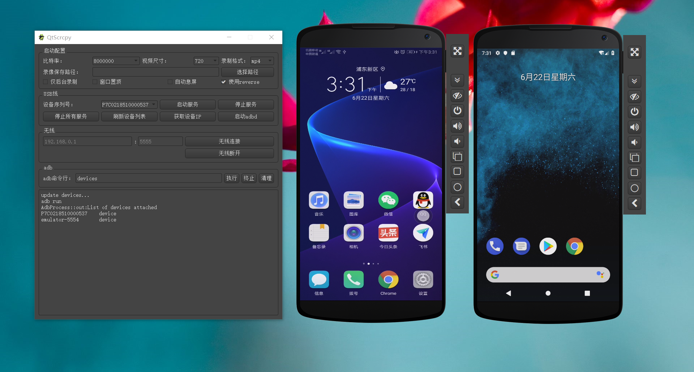
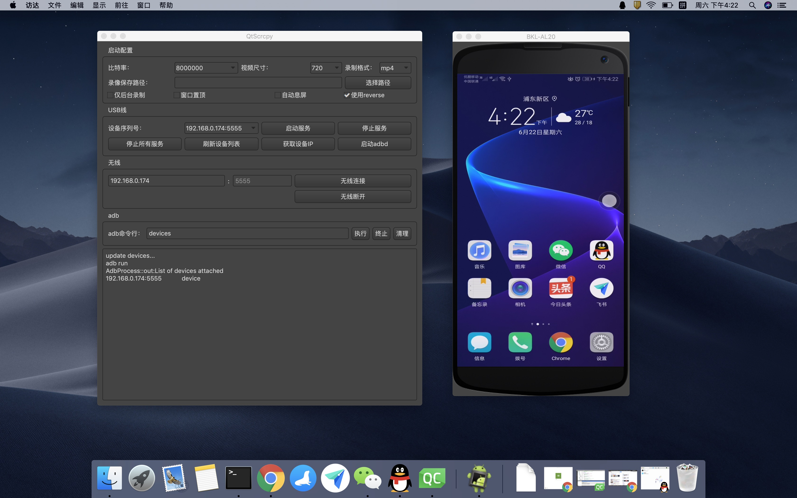
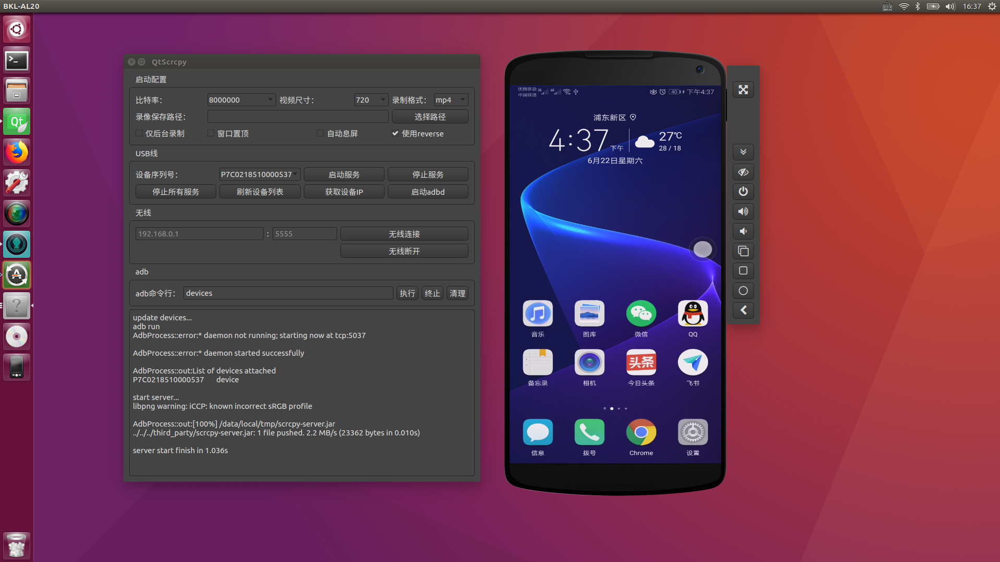
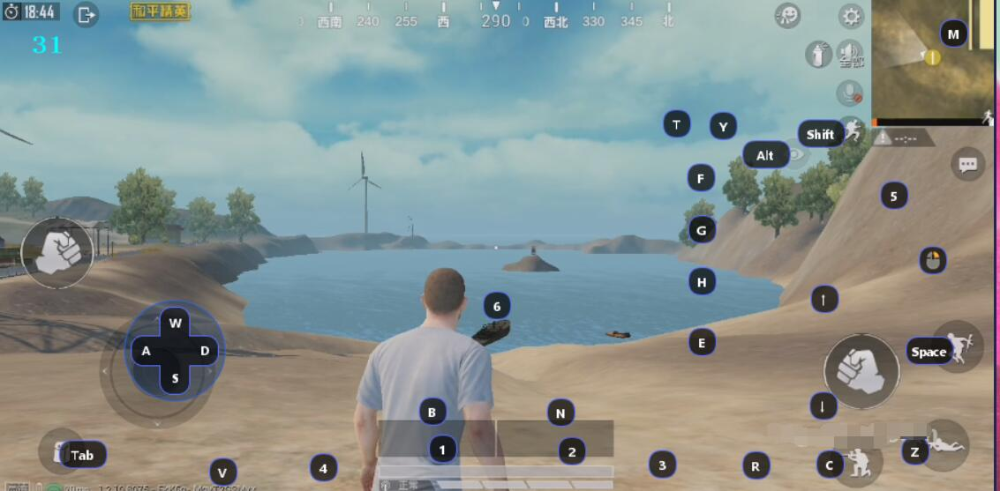
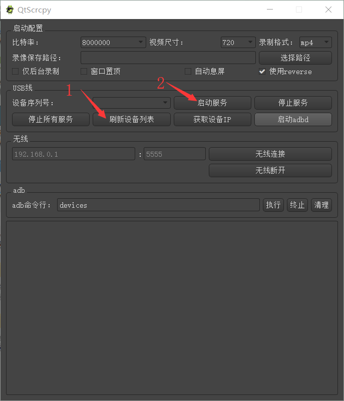

# QtScrcpy

[English introduction](README.md)

QtScrcpy可以通过USB(或通过TCP/IP)连接Android设备，并进行显示和控制。不需要root权限。

单个应用程序最多支持16个安卓设备同时连接。

同时支持GNU/Linux，Windows和MacOS三大主流桌面平台

它专注于:

 - **精致** (仅显示设备屏幕)
 - **性能** (30~60fps)
 - **质量** (1920×1080以上)
 - **低延迟** ([35~70ms][低延迟])
 - **快速启动** (1s内就可以看到第一帧图像)
 - **非侵入性** (不在设备上安装任何软件)

[低延迟]: https://github.com/Genymobile/scrcpy/pull/646

## 自定义按键映射
可以根据需要，自己编写脚本将PC键盘按键映射为手机的触摸点击，编写规则在[这里](docs/KeyMapDes_zh.md)。

默认自带了针对和平精英手游和抖音进行键鼠映射的映射脚本，开启平精英手游后可以用键鼠像玩端游一样玩和平精英手游，开启抖音映射以后可以使用上下左右方向键模拟上下左右滑动，你也可以按照[编写规则](docs/KeyMapDes_zh.md)编写其他游戏的映射文件，默认按键映射如下：

[这里有玩和平精英的视频演示](http://mp.weixin.qq.com/mp/video?__biz=MzU1NTg5MjYyNw==&mid=100000015&sn=3e301fdc5a364bd16d6207fa674bc8b3&vid=wxv_968792362971430913&idx=1&vidsn=eec329cc13c3e24c187dc9b4d5eb8760&fromid=1&scene=20&xtrack=1&clicktime=1567346543&sessionid=1567346375&subscene=92&ascene=0&fasttmpl_type=0&fasttmpl_fullversion=4730859-zh_CN-zip&fasttmpl_flag=0&realreporttime=1567346543910#wechat_redirect)

自定义按键映射操作方法如下：
- 编写自定义脚本放入keymap目录
- 点击刷新脚本，确保脚本可以被检测到
- 选择需要的脚本
- 连接手机并启动服务之后，点击应用脚本
- 按~键（数字键1左边）切换为自定义映射模式即可体验（具体按什么键要看你按键脚本定义的switchKey）
- 再次按~键切换为正常控制模式
- 要想wasd控制开车记得在载具设置中设置为单摇杆模式

## 群控
你可以同时控制所有的手机

## 感谢

基于[Genymobile](https://github.com/Genymobile)的[scrcpy](https://github.com/Genymobile/scrcpy)项目进行复刻，重构，非常感谢。QtScrcpy和原版scrcpy区别如下：

关键点|scrcpy|QtScrcpy
--|:--:|:--:
界面|sdl|qt
视频解码|ffmpeg|ffmpeg
视频渲染|sdl|opengl
跨平台基础设施|自己封装|Qt提供
编程语言|C|C++
编程方式|同步|异步
按键映射|不支持自定义|支持自定义按键映射
编译方式|meson+gradle|Qt Creator

- 使用Qt可以非常容易的定制自己的界面
- 基于Qt的信号槽机制的异步编程提高性能
- 方便新手学习
- 增加多点触控支持

## 学习它
如果你对它感兴趣，想学习它的实现原理而又感觉无从下手，可以选择购买我录制的视频课程，
里面详细介绍了整个软件的开发架构以及开发流程，带你从无到有的开发QtScrcpy：

课程介绍：[https://blog.csdn.net/rankun1/article/details/87970523](https://blog.csdn.net/rankun1/article/details/87970523)

或者你也可以加入我的QtScrcpy QQ群，和志同道合的朋友一块互相交流技术：

QQ群号：901736468

## 要求
Android部分至少需要API 21（Android 5.0）。

您要确保在Android设备上[启用adb调试][enable-adb]。

[enable-adb]: https://developer.android.com/studio/command-line/adb.html#Enabling

## 下载这个软件

[gitee-download]: https://gitee.com/Barryda/QtScrcpy/releases
[github-download]: https://github.com/barry-ran/QtScrcpy/releases

### Windows

Windows平台，你可以直接使用我编译好的可执行程序:

 - [国内下载][gitee-download]
 - [国外下载][github-download]

你也可以[自己编译](##如何编译)

### Mac OS

Mac OS平台，你可以直接使用我编译好的可执行程序:

- [国内下载][gitee-download]
- [国外下载][github-download]

你也可以[自己编译](##如何编译)

### Linux

目前只提供了windows和mac平台的可执行程序，如果需要linux平台的可执行程序，

您通常需要[自己编译](##如何编译)。别担心，这并不难。

目前只在ubuntu上测试过

## 运行

在你的电脑上接入Android设备，然后运行程序，按顺序点击如下按钮即可连接到Android设备

### 无线连接步骤（保证手机和电脑在同一个局域网）：
1. 安卓手机端在开发者选项中打开usb调试
2. 通过usb连接安卓手机到电脑
3. 点击刷新设备，会看到有设备号更新出来
4. 点击获取设备IP
5. 点击启动adbd
6. 无线连接
7. 再次点击刷新设备，发现多出了一个IP地址开头的设备，选择这个设备
8. 启动服务

备注：启动adbd以后不用再连着usb线了，以后连接断开都不再需要，除非安卓adbd停了需要重新启动

## 界面按钮介绍：

- 启动配置：启动服务前的功能参数设置    

    分别可以设置本地录制视频的比特率、分辨率、录制格式、录像保存路径等。

    - 仅后台录制：启动服务不现实界面，只是录制Android设备屏幕
    - 窗口置顶：Android设备视频窗口置顶显示
    - 自动息屏：启动服务以后，自动关闭Android设备屏幕节省电量
    - 使用reverse：服务启动模式，出现服务启动失败报错more than one device可以去掉这个勾选尝试连接
    
- 刷新设备列表：刷新当前连接的设备
- 启动服务：连接到Android设备
- 停止服务：断开与Android设备的连接
- 停止所有服务：断开所有已连接的Android设备
- 获取设备ip：获取到Android设备的ip地址，更新到“无线”区域中，方便进行无线连接
- 启动adbd：启动Android设备的adbd服务，无线连接之前，必须要启动。
- 无线连接：使用无线方式连接Android设备
- 无线断开：断开无线方式连接的Android设备
- adb命令行：方便执行自定义adb命令（目前不支持阻塞命令，例如shell）

## 主要功能
- 实时显示Android设备屏幕
- 实时键鼠控制Android设备
- 屏幕录制
- 截图为png
- 无线连接
- 最多支持16台设备连接（PC性能允许的情况下可以增加，需要自己编译）
- 全屏显示
- 窗口置顶
- 安装apk：拖拽apk到视频窗口即可安装
- 传输文件：拖拽文件到视频窗口即可发送文件到Android设备
- 后台录制：只录制，不显示界面
- 复制粘贴

    在计算机和设备之间双向同步剪贴板：
    - `Ctrl` + `c`将设备剪贴板复制到计算机剪贴板；
    - `Ctrl` + `Shift` + `v`将计算机剪贴板复制到设备剪贴板；
    - `Ctrl` +`v` 将计算机剪贴板作为一系列文本事件发送到设备（不支持非ASCII字符）。
- 群控

## 快捷键

 | 功能                                   |   快捷键(Windows)              |   快捷键 (macOS)
 | -------------------------------------- |:----------------------------- |:-----------------------------
 | 切换全屏                               | `Ctrl`+`f`                     | `Cmd`+`f`
 | 调整窗口大小为 1:1                      | `Ctrl`+`g`                    | `Cmd`+`g`
 | 调整窗口大小去除黑边                    | `Ctrl`+`x` \| _左键双击_       | `Cmd`+`x`  \| _左键双击_
 | 点击 `主页`                            | `Ctrl`+`h` \| _点击鼠标中键_    | `Ctrl`+`h` \| _点击鼠标中键_
 | 点击 `BACK`                            | `Ctrl`+`b` \| _右键双击_       | `Cmd`+`b`  \| _右键双击_
 | 点击 `APP_SWITCH`                      | `Ctrl`+`s`                    | `Cmd`+`s`
 | 点击 `MENU`                            | `Ctrl`+`m`                    | `Ctrl`+`m`
 | 点击 `VOLUME_UP`                       | `Ctrl`+`↑` _(上)_             | `Cmd`+`↑` _(上)_
 | 点击 `VOLUME_DOWN`                     | `Ctrl`+`↓` _(下)_             | `Cmd`+`↓` _(下)_
 | 点击 `POWER`                           | `Ctrl`+`p`                    | `Cmd`+`p`
 | 打开电源                               | _右键双击_                     | _右键双击_
 | 关闭屏幕 (保持投屏)                     | `Ctrl`+`o`                    | `Cmd`+`o`
 | 打开下拉菜单                           | `Ctrl`+`n`                    | `Cmd`+`n`
 | 关闭下拉菜单                           | `Ctrl`+`Shift`+`n`            | `Cmd`+`Shift`+`n`
 | 复制设备剪切板到电脑                    | `Ctrl`+`c`                    | `Cmd`+`c`
 | 粘贴电脑剪切板到设备                    | `Ctrl`+`v`                    | `Cmd`+`v`
 | 复制电脑剪切板到设备                    | `Ctrl`+`Shift`+`v`            | `Cmd`+`Shift`+`v`

鼠标左键双击黑色区域可以去除黑色区域

如果电源关闭，鼠标右键双击打开电源；如果电源开启，鼠标右键双击相当于返回

## TODO
[后期计划](docs/TODO.md)

## FAQ
[常见问题说明](docs/FAQ.md)

## 开发者
[开发者相关](docs/DEVELOP.md)

欢迎大家一起维护这个项目，贡献自己的代码，不过请遵循一下几点要求：
1. pr请提到dev分支，不要提到master分支
2. 提pr之前请先rebase dev
3. pr请以少量多次的原则提交（建议一个小的功能点提一个pr）
4. 代码风格请保持和已有风格一致

## 为什么开发QtScrcpy？
综合起来有以下几个原因，比重从大到小排列：
1. 学习Qt的过程中需要一个项目实战一下
2. 本身具有音视频相关技能，对音视频很感兴趣
3. 本身具有Android开发技能，好久没用有点生疏，需要巩固一下
4. 发现了scrcpy，决定用新的技术栈（C++ + Qt + Opengl + ffmpeg）复刻一下

## 如何编译
尽量提供了所有依赖资源，方便傻瓜式编译。

### PC端
1. 目标平台上搭建Qt开发环境(Qt == 5.15, vs == 2017 (**不支持mingw**))
2. 克隆该项目
3. 使用QtCreator打开项目根目录all.pro
4. 编译，运行即可

### Android端 （没有修改需求的话直接使用自带的scrcpy-server即可）
1. 目标平台上搭建Android开发环境
2. 使用Android Studio打开项目根目录中的server项目
3. 第一次打开如果你没有对应版本的gradle会提示找不到gradle，是否升级gradle并创建，选择取消，取消后会弹出选择已有gradle的位置，同样取消即可（会自动下载）
4. 按需编辑代码即可，当然也可以不编辑
4. 编译出apk以后改名为scrcpy-server并替换third_party/scrcpy-server即可

## Licence
由于是复刻的scrcpy，尊重它的Licence

    Copyright (C) 2020 Barry
    
    Licensed under the Apache License, Version 2.0 (the "License");
    you may not use this file except in compliance with the License.
    You may obtain a copy of the License at
    
        http://www.apache.org/licenses/LICENSE-2.0
    
    Unless required by applicable law or agreed to in writing, software
    distributed under the License is distributed on an "AS IS" BASIS,
    WITHOUT WARRANTIES OR CONDITIONS OF ANY KIND, either express or implied.
    See the License for the specific language governing permissions and
    limitations under the License.

## 关于作者

[Barry的CSDN](https://blog.csdn.net/rankun1)

一枚普通的程序员，工作中主要使用C++进行桌面客户端开发，一毕业在山东做过一年多钢铁仿真教育软件，后来转战上海先后从事安防，在线教育相关领域工作，对音视频比较熟悉，对音视频领域如语音通话，直播教育，视频会议等相关解决方案有所了解。同时具有android，linux服务器等开发经验。