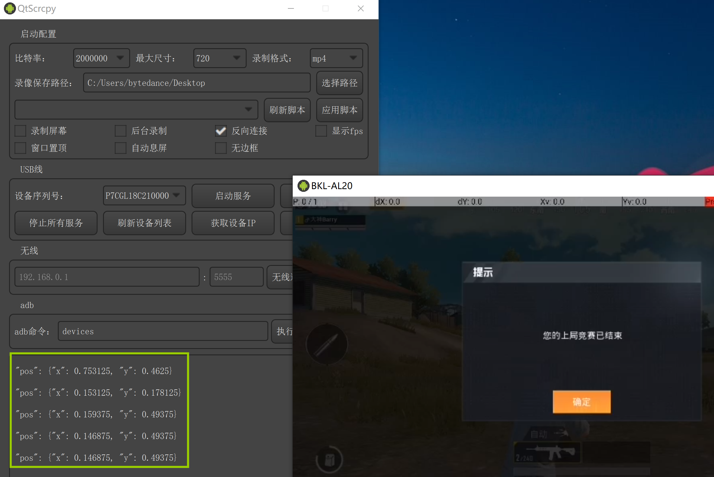
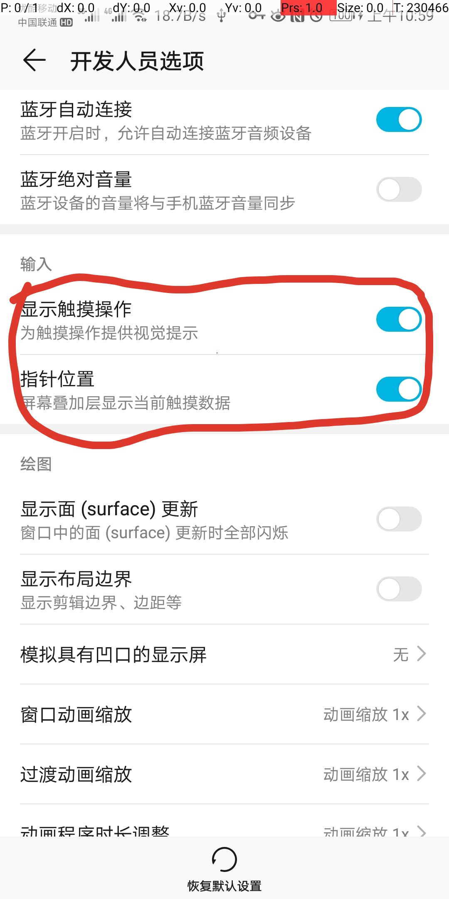

# 自定义按键映射说明

按键映射文件为json格式，新增自己的按键映射文件需要放在keymap目录中才可以被QtScrcpy识别。

按键映射文件的具体编写格式下面会介绍，也可以参考自带的按键映射文件。

## 按键映射脚本格式说明

### 通用说明

- 按键映射中的坐标位置都是用相对位置表示的，屏幕的宽高都用1表示，例如屏幕的像素为1920x1080，那么坐标(0.5,0.5)则表示的是
以屏幕左上角为原点，像素坐标(1920,1080)*(0.5,0.5)=(960,540)的位置。
    
    或者鼠标左键单击时控制台会输出此时的pos，直接使用这个pos即可
    

- 按键映射中的按键码是用Qt的枚举表示的，详细说明可以[参考Qt文档]( https://doc.qt.io/qt-5/qt.html )(搜索 The key names used by Qt. 可以快速定位)。
- 开发人员选项中打开如下两个设置，可以方便的观察触摸点的坐标：

### 映射类型说明

- switchKey：切换自定义按键映射的开关键，默认为普通映射，需要使用这个按键在普通映射和自定义映射之间切换。

- mouseMoveMap：鼠标移动映射，鼠标的移动将被映射为以startPos为起点，以鼠标移动方向为移动方向的手指拖动操作（开启鼠标移动映射以后会隐藏鼠标，限制鼠标移动范围）。
一般在FPS手游中用来调整人物视野。
    - startPos 手指拖动起始点
    - speedRatio 鼠标移动映射为手指拖动的比例，可以控制鼠标灵敏度，数值要大于0.00，数值越大，灵敏度越低
    - smallEyes 触发小眼睛的按键，按下此按键以后，鼠标的移动将被映射为以smallEyes.pos为起点，以鼠标移动方向为移动方向的手指拖动操作

- keyMapNodes 一般按键的映射，json数组，所有一般按键映射都放在这个数组中，将键盘的按键映射为普通的手指点击。

一般按键映射有如下几种类型：

- type 按键映射的类型，每个keyMapNodes中的元素都需要指明，可以是如下类型：
    - KMT_CLICK 普通点击，按键按下模拟为手指按下，按键抬起模拟为手指抬起
    - KMT_CLICK_TWICE 两次点击，按键按下模拟为手指按下再抬起，按键抬起模拟为手指按下再抬起
    - KMT_CLICK_MULTI 多次点击，根据clickNodes数组中的delay和pos实现一个按键多次点击
    - KMT_DRAG 拖拽，按键按下模拟为手指按下并拖动一段距离，按键抬起模拟为手指抬起
    - KMT_STEER_WHEEL 方向盘映射，专用于FPS游戏中移动人物脚步的方向盘的映射，需要4个按键来配合。

不同按键映射类型的专有属性说明：

- KMT_CLICK
    - key 要映射的按键码
    - pos 模拟触摸的位置
    - switchMap 是否释放出鼠标，点击此按键后，除了默认的模拟触摸映射，是否释放出鼠标操作。（可以参考和平精英映射中M地图映射的效果）

- KMT_CLICK_TWICE
    - key 要映射的按键码
    - pos 模拟触摸的位置

- KMT_CLICK_MULTI
    - delay 延迟delay毫秒以后再模拟触摸
    - pos 模拟触摸的位置

- KMT_DRAG
    - key 要映射的按键码
    - startPos 模拟触摸拖动的开始位置
    - endPos 模拟触摸拖动的结束位置

- KMT_STEER_WHEEL
    - centerPos 方向盘中心点
    - leftKey 左方向的按键控制
    - rightKey 右方向的按键控制
    - upKey 上方向的按键控制
    - downKey 下方向的按键控制
    - leftOffset 按下左方向键后模拟拖动到相对centerPos位置水平偏左leftOffset处
    - rightOffset 按下右方向键后模拟拖动到相对centerPos位置水平偏右rightOffset处
    - upOffset 按下上方向键后模拟拖动到相对centerPos位置水平偏上upOffset处
    - downOffset 按下下方向键后模拟拖动到相对centerPos位置水平偏下downOffset处
    

    
